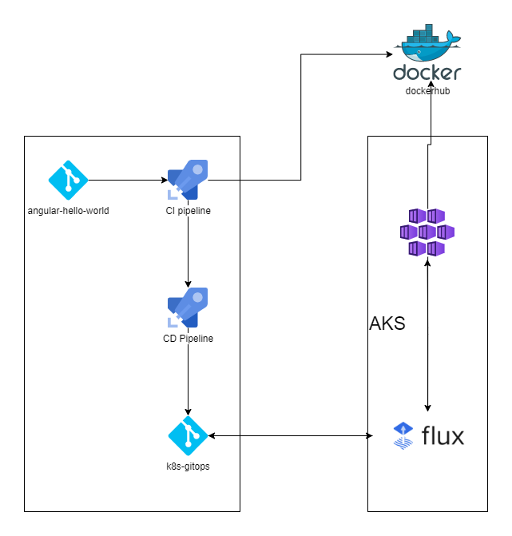

# GitOps: Flux with AKS and Azure DevOps

## Prerequisites

* A running AKS cluster
* Flux CLI - [Binary](https://github.com/fluxcd/flux2/releases)  
* Flux Web UI(Optional) -  [Binary](https://github.com/fluxcd/webui/releases)  
* An Azure DevOps Organization and Project - [Free Account](https://azure.microsoft.com/en-us/free/)

## Deployment Architecture



## Repo and pipeline setup

### Import the below GitHub Repos to the Azure DevOps project

[Importing repos to Azure DevOps](https://docs.microsoft.com/en-us/azure/devops/repos/git/import-git-repository?view=azure-devops)

* Application repo - [angular-hello-world](https://github.com/siva11psk/angular-hello-world)  
* GitOps repo - [k8-gitops](https://github.com/siva11psk/k8-gitops)

Note - Import the repos with the same names for the pipelines to work without additional changes

### Import the pipelines

The application repo has the .pipelines folder containiing the below pipelines  

* angular-hello-world-ci.yml - CI pipeline for pushing the image to Docker registry. Rename the pipeline as angular-hello-world-ci after importing.  
* angular-hello-world-cd.yml - CD pipeline for pusing the updated manifests to the gitops repo. Rename the pipeline as angular-hello-world-ci after importing.  

### Pipeline  updates

* Add variables to the CI pipeline
    * REPOISTORY - {THE DOCKER IMAGE REPO} #Example - sivakumarendava/angular-hello-world
    * REGISTRY_PASSWORD - {THE DOCKER REGISTRY PASSWORD}
    * REGISTRY_USER - {THE DOCKER USERNAME}

* Create an environment for the CD pipeline name DEV - see [here](https://docs.microsoft.com/en-us/azure/devops/pipelines/process/environments).  

* Grant Version Control Permissions to the build service - see [here](https://docs.microsoft.com/en-us/azure/devops/pipelines/scripts/git-commands?preserve-view=true&tabs=yaml&view=azure-devops#grant-version-control-permissions-to-the-build-service).

### Run the CI CD pipelines

* Run the CI pipeline to push the image to Dockerhub  
* The CD pipeline should get triggered when the CI pipeline completes, and it should create a PR in the k8-gitops repo with the application manifests
* Review and complete the PR so that the main branch of the k8-gitops repo has the application manifests

## Flux Configuration

* Checkout the k8-gitops repo and execute the commands in the root directory of the checked out repo.  

* Connect to your AKS cluster

* Execute the below command to generate the flux components yaml file

    ```bash
    flux install --export > ./clusters/my-cluster/flux-system/gotk-components.yaml
    ```
* Apply the yaml configuration  

    ```bash
    kubectl apply -f ./clusters/my-cluster/flux-system/gotk-components.yaml
    ```
* Execute the below command and verify that the flux components are installed in the flux-system namespace

    ```bash
    kubectl get deployments,services -n flux-system 
    ```

* Create a Git repository source in the flux namespace

    ```bash
    flux create source git flux-system \
        --git-implementation=libgit2 \
        --url={PATH TO THE GITOPS REPO} \ #example - https://dev.azure.com/SivakumarPalanisamy0258/AKS-Flux-Demo/_git/k8s-gitops
        --branch=main \
        --username=git \
        --password={PASSWORD}} \
        --interval=1m
    ```

* Create a kustomization in the flux namespace

    ```bash
    flux create kustomization flux-system \
        --source=flux-system \
        --path="./clusters/my-cluster" \
        --prune=true \
        --interval=3m
    ```
* Export the source and kustomization as yaml files and add to the repo(Flux will manage itself from the git repo)  

    ```bash
    flux export source git flux-system \
    > ./clusters/my-cluster/flux-system/gotk-sync.yaml

    flux export kustomization flux-system \
    >> ./clusters/my-cluster/flux-system/gotk-sync.yaml
    ```

* Check-in all the files and push the changes to remote

* As soon as the changes are pushed to the repo, the synchronization should start and the k8s objects defined in the app-manifests folder will get deployed to the cluster(namespace, deployment and service).

* The deployment of the pods might fail as it expects an image pull secret.

* Create an image pull secret for the k8s deployment to access your dockerhub registry

    ```bash
    #Create secret for image pull
    kubectl create secret docker-registry dockerhub-cred --docker-server="https://index.docker.io/v1/" \
     --docker-username="{YOUR DOCKER USERNAME}" --docker-password="{YOUR DOCKER PASSWORD}" \
     --docker-email="{YOUR DOCKER EMAIL}" --namespace=dev
    ```

* As soon as the secret got created, the deployment of the pods will succeed in the next synchronization. The service will be accessible through the load balancer IP.

* Execute the below command to see the kustomizations

    ```bash
    flux get kustomizations --watch
    ```

* Execute the below command and open http://localhost:9000/ to launch the flux web UI

    ```bash
    {path to the flux web binary}/flux-web.exe
    ```


## References

* [GitOps with AzureDevOps](https://docs.microsoft.com/en-us/azure/azure-arc/kubernetes/tutorial-gitops-flux2-ci-cd)
* [Flux 2.0 with Azure](https://fluxcd.io/docs/use-cases/azure/)
* [Flux web UI](https://github.com/fluxcd/webui)